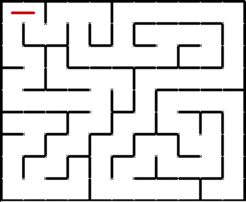

# Labyrinth

The objective is to build a 5x5 labyrinth in witch we start at a "start" and end at the finish, we have some blocks with a "wall" from witch we cannot pas through. This goal must be achieved with an uninformed search, the algorithm that will be used is a BFS or DFS search algorithm.

